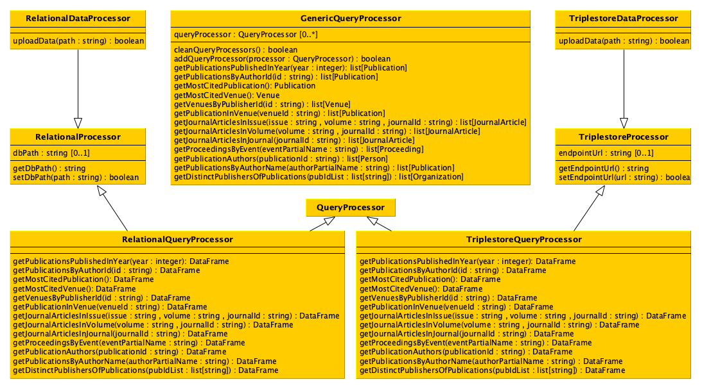

# SoupSoftware
This repository contains the software developed for the "Computational Management of Data" course of the master's degree in [Digital Humanities and Digital Knowledge](https://corsi.unibo.it/2cycle/DigitalHumanitiesKnowledge) of the University of Bologna.

The goal of the project is to develop a software capable of processing and storing specific bibliographical data. Given CSV and JSON files as input, it is possible to upload their contents in both a relational and a RDF triplestore database. By recalling the developed methods, it is also possible to simultaneously query the databases and retrieve the wanted information. The results are nomally provided to the used as a list of Python objects.
_____________
## Documentation

### Data

Exemplar data for testing the project:

* Two CSV files ([CSV file 1](SoupGroup/sample data/graph_publications.csv) [CSV file 2](SoupGroup/sample data/relational_publications.csv)) containing data about publications and two JSON files ([JSON file](SoupGroup/sample data/graph_other_data.json) [JSON file 2](SoupGroup/sample data/relational_other_data.json)) containing additional information including the authors of each publication, the identifiers of the venue of each publication, and the identifier and name of each publisher publishing the venues;


## UML of data model classes


The methods of each class return the appropriate value that have been specified in the object of that class when it has been created. 

## UML of additional classes




## Classes and methods

### Class `RelationalProcessor`

#### Attributes
`dbPath`: the variable containing the path of the database, initially set as an empty string, that will be updated with the method `setDbPath`.

#### Methods
`getDbPath`: it returns the path of the database.

`setDbPath`: it enables to set a new path for the database to handle.

### Class `TriplestoreProcessor`

#### Attributes
`endpointUrl`: the variable containing the URL of the SPARQL endpoint of the triplestore, initially set as an empty string, that will be updated with the method `setEndpointUrl`.

#### Methods
`getEndpointUrl`: it returns the URL of the SPARQL endpoint of the triplestore.

`setEndpointUrl`: it enables to set a new URL for the SPARQL endpoint of the triplestore.

### Classes `RelationalDataProcessor` and `TriplestoreDataProcessor`

#### Methods
`uploadData`: it enables to upload the collection of data specified in the input file path (either in CSV or JSON, according to the [formats specified above](#source-data)) into the database.

### Classes `RelationalQueryProcessor` and `TriplestoreQueryProcessor`

#### Methods
`getPublicationsPublishedInYear`: It returns a data frame with all the publications (i.e. the rows) that have been published in the input year (e.g. `2020`).

`getPublicationsByAuthorId`: It returns a data frame with all the publications (i.e. the rows) that have been authored by the person having the identifier specified as input (e.g. `"0000-0001-9857-1511"`).

`getMostCitedPublication`: It returns a data frame with all the publications (i.e. the rows) that have received the most number of citations by other publications.

`getMostCitedVenue`: It returns a data frame with all the venues (i.e. the rows) containing the publications that, overall, have received the most number of citations by other publications.

`getVenuesByPublisherId`: It returns a data frame with all the venues (i.e. the rows) that have been published by the organisation having the identifier specified as input (e.g. `"crossref:78"`).

`getPublicationInVenue`: It returns a data frame with all the publications (i.e. the rows) that have been included in the venue having the identifier specified as input (e.g. `"issn:0944-1344"`).

`getJournalArticlesInIssue`: It returns a data frame with all the journal articles (i.e. the rows) that have been included in the input issue (e.g. `"9"`) of the input volume (e.g. `"17"`) of the journal having the identifier specified as input (e.g. `"issn:2164-5515"`).

`getJournalArticlesInVolume`: It returns a data frame with all the journal articles (i.e. the rows) that have been included, independently from the issue, in input volume (e.g. `"17"`) of the journal having the identifier specified as input (e.g. `"issn:2164-5515"`).

`getJournalArticlesInJournal`: It returns a data frame with all the journal articles (i.e. the rows) that have been included, independently from the issue and the volume, in the journal having the identifier specified as input (e.g. `"issn:2164-5515"`).

`getProceedingsByEvent`: It returns a data frame with all the proceedings (i.e. the rows) that refer to the events that match (in lowercase), even partially, with the name specified as input (e.g. `"web"`).

`getPublicationAuthors`: It returns a data frame with all the authors (i.e. the rows) of the publication with the identifier specified as input (e.g. `"doi:10.1080/21645515.2021.1910000"`).

`getPublicationsByAuthorName`: It returns a data frame with all the publications (i.e. the rows) that have been authored by the people having their name matching (in lowercase), even partially, with the name specified as input (e.g. `"doe"`).

`getDistinctPublisherOfPublications`: It returns a data frame with all the distinct publishers (i.e. the rows) that have published the venues of the publications with identifiers those specified as input (e.g. `[ "doi:10.1080/21645515.2021.1910000", "doi:10.3390/ijfs9030035" ]`).

### Class `GenericQueryProcessor`

#### Attributes
`queryProcessor`: the variable containing the list of `QueryProcessor` objects to involve when one of the *get* methods below is executed. In practice, every time a *get* method is executed, the method will call the related method on all the `QueryProcessor` objects included in the variable `queryProcessor`, before combining the results and returning the requested object.

#### Methods
`cleanQueryProcessors`: It clean the list `queryProcessor` from all the `QueryProcessor` objects it includes.

`addQueryProcessor`: It append the input `QueryProcessor` object to the list `queryProcessor`.

`getPublicationsPublishedInYear`: It returns a list of `Publication` objects referring to all the publications that have been published in the input year (e.g. `2020`).

`getPublicationsPublishedInYear`: It returns a list of `Publication` objects referring to all the publications that have been published in the input year (e.g. `2020`).

`getPublicationsByAuthorId`: It returns a list of `Publication` objects referring to all the publications that have been authored by the person having the identifier specified as input (e.g. `"0000-0001-9857-1511"`).

`getMostCitedPublication`: It returns the `Publication` object that has received the most number of citations by other publications.

`getMostCitedVenue`: It returns the `Venue` object containing the publications that, overall, have received the most number of citations by other publications.

`getVenuesByPublisherId`: It returns a list of `Venue` objects referring to all the venues that have been published by the organisation having the identifier specified as input (e.g. `"crossref:78"`).

`getPublicationInVenue`: It returns a list of `Publication` objects referring to all the publications that have been included in the venue having the identifier specified as input (e.g. `"issn:0944-1344"`).

`getJournalArticlesInIssue`: It returns a list of `JournalArticle` objects referring to all the journal articles that have been included in the input issue (e.g. `"9"`) of the input volume (e.g. `"17"`) of the journal having the identifier specified as input (e.g. `"issn:2164-5515"`).

`getJournalArticlesInVolume`: It returns a list of `JournalArticle` objects referring to all the journal articles that have been included, independently from the issue, in input volume (e.g. `"17"`) of the journal having the identifier specified as input (e.g. `"issn:2164-5515"`).

`getJournalArticlesInJournal`: It returns a list of `JournalArticle` objects referring to all the journal articles that have been included, independently from the issue and the volume, in the journal having the identifier specified as input (e.g. `"issn:2164-5515"`).

`getProceedingsByEvent`: It returns a list of `Proceedings` objects referring to all the proceedings that refer to the events that match (in lowercase), even partially, with the name specified as input (e.g. `"web"`).

`getPublicationAuthors`: It returns a list of `Person` objects referring to all the authors of the publication with the identifier specified as input (e.g. `"doi:10.1080/21645515.2021.1910000"`).

`getPublicationsByAuthorName`: It returns a list of `Publication` objects referring to all the publications that have been authored by the people having their name matching (in lowercase), even partially, with the name specified as input (e.g. `"doe"`).

`getDistinctPublisherOfPublications`: It returns a list of `Organization` objects referring to all the distinct publishers that have published the venues of the publications with identifiers those specified as input (e.g. `[ "doi:10.1080/21645515.2021.1910000", "doi:10.3390/ijfs9030035" ]`).

## Uses of the classes

```
# Supposing that all the classes developed for the project
# are contained in the file 'impl.py', then:

# 1) Importing all the classes for handling the relational database
from impl import RelationalDataProcessor, RelationalQueryProcessor

# 2) Importing all the classes for handling RDF database
from impl import TriplestoreDataProcessor, TriplestoreQueryProcessor

# 3) Importing the class for dealing with generic queries
from impl import GenericQueryProcessor

# Once all the classes are imported, first create the relational
# database using the related source data
rel_path = "relational.db"
rel_dp = RelationalDataProcessor()
rel_dp.setDbPath(rel_path)
rel_dp.uploadData("data/relational_publications.csv")
rel_dp.uploadData("data/relational_other_data.json")

# Then, create the RDF triplestore (remember first to run the
# Blazegraph instance) using the related source data
grp_endpoint = "http://127.0.0.1:9999/blazegraph/sparql"
grp_dp = TriplestoreDataProcessor()
grp_dp.setEndpointUrl(grp_endpoint)
grp_dp.uploadData("data/graph_publications.csv")
grp_dp.uploadData("data/graph_other_data.json")

# In the next passage, create the query processors for both
# the databases, using the related classes
rel_qp = RelationalQueryProcessor()
rel_qp.setDbPath(rel_path)

grp_qp = TriplestoreQueryProcessor()
grp_qp.setEndpointUrl(grp_endpoint)

# Finally, create a generic query processor for asking
# about data
generic = GenericQueryProcessor()
generic.addQueryProcessor(rel_qp)
generic.addQueryProcessor(grp_qp)

result_q1 = generic.getPublicationsPublishedInYear(2020)
result_q2 = generic.getPublicationsByAuthorId("0000-0001-9857-1511")
# etc...
```

_____________
Authors of the project:
- [Maddalena Ghiotto](https://github.com/MaddaGh)
- [Lorenzo Paolini](https://github.com/Postitisnt)
- [Bianca La Manna](https://github.com/Bianca-LM)
- [Tommaso Battisti](https://github.com/tommasobattisti)
